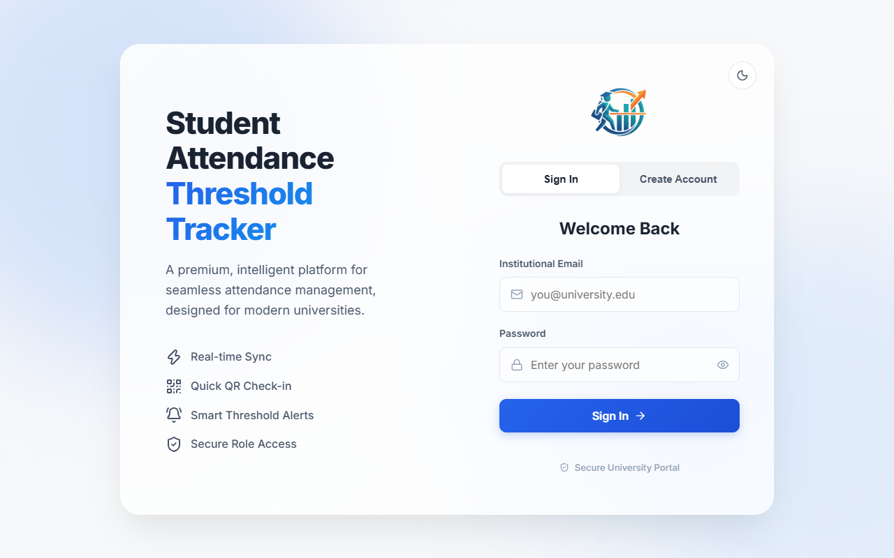
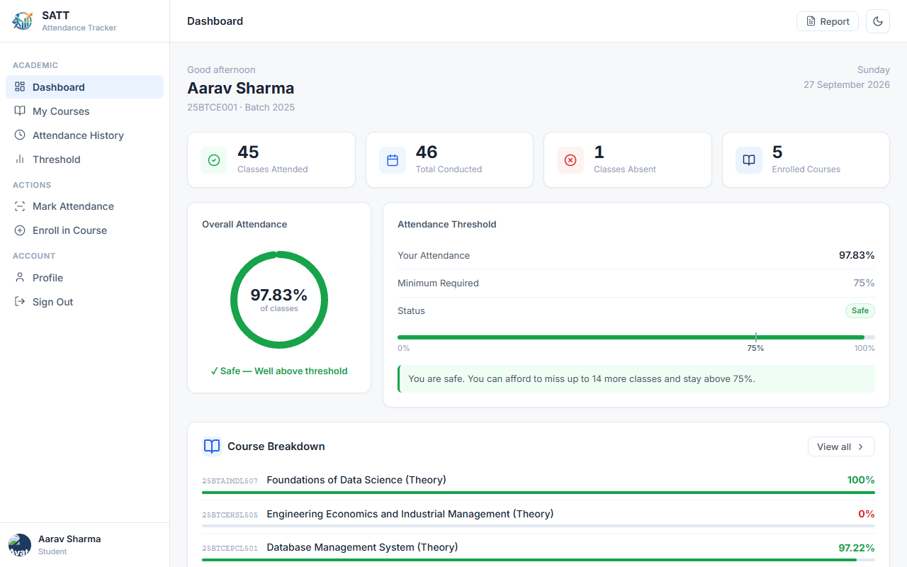
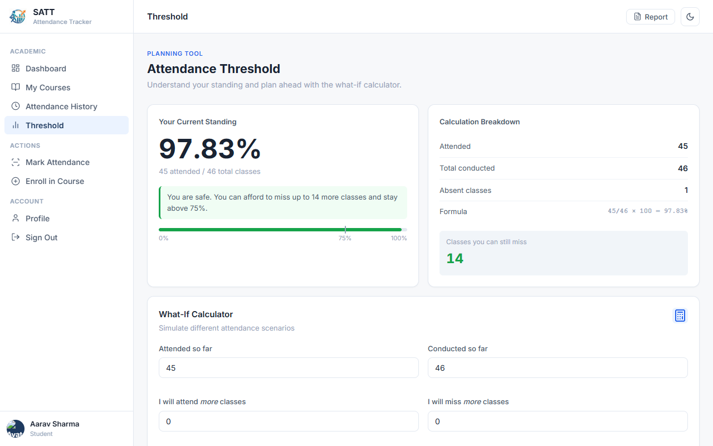
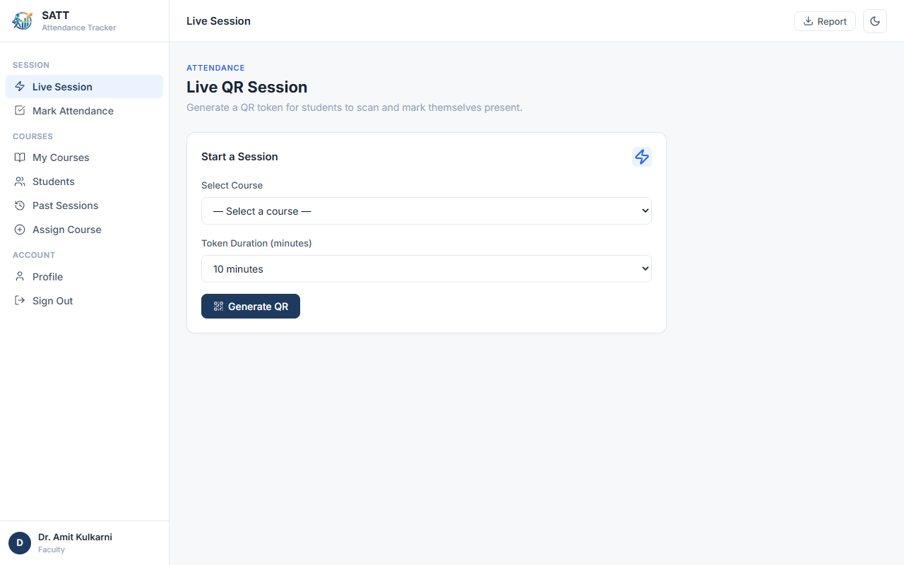
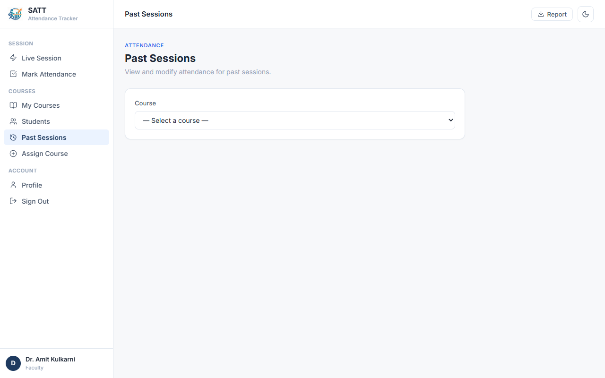
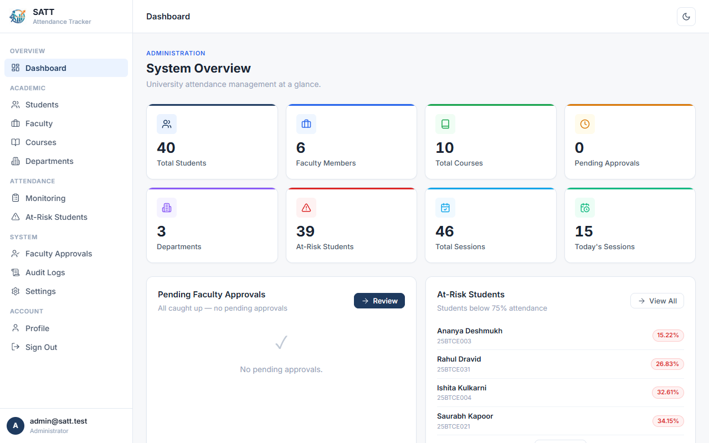
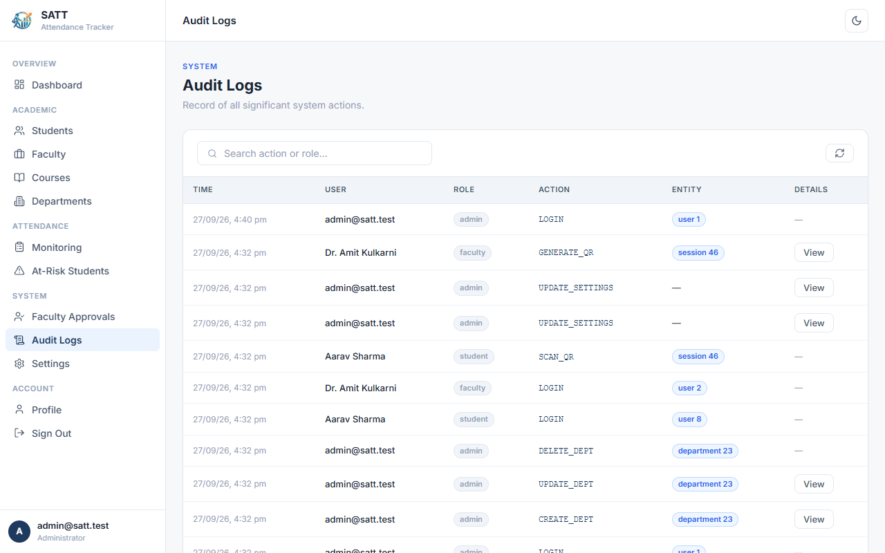
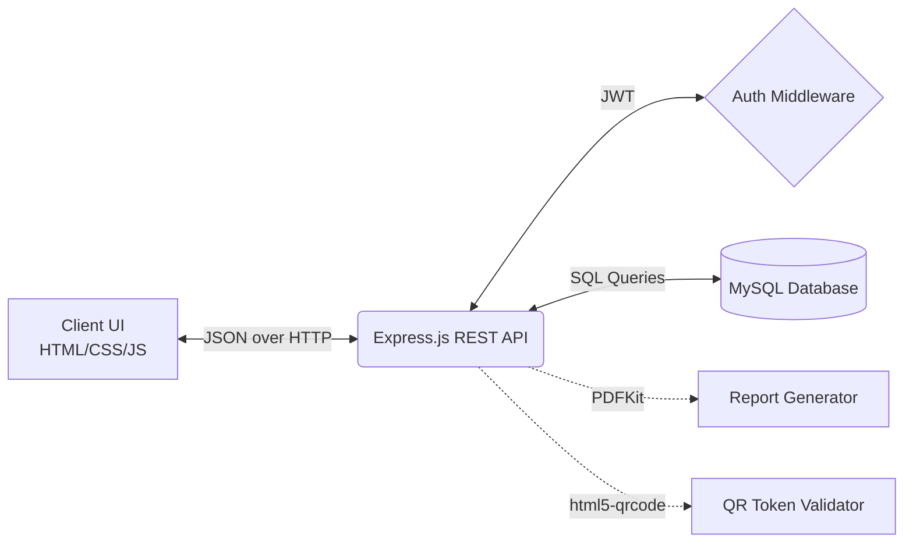

<div align="center">
  

  # Student Attendance Threshold Tracker (SATT)

  **Centralized, role-based application for tracking and managing university student attendance.**

  [](https://nodejs.org/)
  [](https://expressjs.com/)
  [](https://www.mysql.com/)
  [](#)
  [](#)
  [](#)
</div>

<br/>

## 📖 Project Overview

**SATT (Student Attendance Threshold Tracker)** solves the critical problem of attendance tracking in modern universities. It ensures students meet mandatory academic attendance thresholds by providing a real-time tracking system. 

SATT empowers **Faculty** to generate secure, live QR codes for rapid in-class attendance, allows **Students** to track their attendance status instantly and simulate "what-if" scenarios, and gives **Administrators** powerful system-wide analytics and management tools.

---

## ✨ Key Features

- **Live QR Attendance**: Faculty can launch live sessions that generate rotating QR codes. Students scan them to securely record their attendance.
- **What-If Threshold Calculator**: Students can simulate future attendance to see exactly how many classes they can miss or must attend to stay above the university threshold (default 75%).
- **Interactive Glassmorphism UI**: A premium, visually stunning UI featuring smooth transitions, frosted glass effects, and a dynamic mesh gradient background.
- **Responsive Dark/Light Theme**: Fully supported across all dashboards for comfortable day or night viewing.
- **PDF Report Generation**: Students can download official, cleanly formatted PDF reports of their attendance records using `PDFKit`.
- **Role-Based Workflows**: Distinct dashboards and API boundaries for Administrators, Faculty, and Students.
- **Secure Authentication**: Robust JWT-based authentication with `bcrypt` password hashing.

---

## 👥 Role-Based Features

### 🎓 Student Portal
- **Dashboard Overview**: View aggregate attendance statistics across all enrolled courses.
- **What-If Calculator**: Calculate the exact number of classes required to reach the threshold or how many can be safely skipped.
- **QR Scanner**: Integrated HTML5 QR scanner to mark attendance during live faculty sessions.
- **PDF Reports**: Export course-wise attendance history to an official PDF document.

### 👨‍🏫 Faculty Portal
- **Live Sessions**: Start live classes, generating secure, time-sensitive QR tokens for students to scan.
- **Manual Attendance**: Manually mark students present/absent via a fast, toggle-based UI.
- **Past Sessions Manager**: Search, filter, and retroactively edit attendance for previous sessions.
- **Course Management**: View assigned courses and the list of enrolled students.

### 🛡️ Admin Portal
- **System Dashboard**: View top-level university statistics (total students, active sessions, at-risk students).
- **User Management**: Register and manage students and faculty members.
- **Academic Setup**: Create and manage Departments, Courses, and Faculty Assignments.
- **Audit Logs**: Track sensitive system actions and login events.

---

## 📸 Application Preview

### Authentication & UI
<div align="center">
  
  <br/>
  <em>Modern Glassmorphism Login Interface</em>
</div>

### Student View
| Dashboard | Threshold & What-If Calculator |
| :---: | :---: |
|  |  |

### Faculty View
| Live QR Session | Past Sessions Management |
| :---: | :---: |
|  |  |

### Administrator View
| System Overview | Audit Logs |
| :---: | :---: |
|  |  |

*(Note: Screenshots demonstrate actual, implemented application features in both Light and Dark modes.)*

---

## 🏗️ System Architecture

SATT operates on a standard client-server architecture, using a decoupled vanilla frontend talking to a RESTful Node.js backend.



### 💻 Technology Stack

- **Frontend**: HTML5, CSS3 (Vanilla, Custom Design Tokens), JavaScript (ES6)
- **Backend**: Node.js, Express.js
- **Database**: MySQL 2
- **Security**: `jsonwebtoken` (JWT), `bcrypt`
- **Libraries**: `pdfkit` (PDF generation), `multer` (File uploads), `lucide` (Icons), `qrcode.js` / `html5-qrcode`

---

## 📂 Project Structure

```text
Student-Attendance-Threshold-Tracker-SATT/
├── server.js               # Main Express backend & REST API definition
├── package.json            # Node.js dependencies
├── schema_v2.sql           # Core database schema
├── database/
│   └── seed.sql            # Synthetic test dataset for development
├── test_apis.js            # Automated test suite
├── .env.template           # Template for environment variables
└── public/                 # Frontend Application
    ├── index.html          # Authentication / Login UI
    ├── app.js              # Global frontend utilities & API wrapper
    ├── styles.css          # Centralized theme and design system (Glassmorphism)
    ├── admin/              # Administrator dashboard & logic
    ├── faculty/            # Faculty dashboard & logic
    ├── student/            # Student dashboard & logic
    └── assets/             # Brand logos and images
```

---

## 🧮 Core Workflows

### 1. QR Attendance Workflow
1. Faculty selects a course and clicks **"Start Live Session"**.
2. The backend records a new `session` and generates a temporary, cryptographically secure `qr_token` mapped to that session.
3. The Faculty dashboard displays a rotating QR code.
4. Students use the built-in scanner on their dashboard to read the QR code.
5. The backend validates the token, ensures the student is enrolled in the course, and checks the token's expiration.
6. An `attendance_record` is inserted marking the student as 'Present'.

### 2. Threshold Calculation Logic
The system actively evaluates a student's standing against a configurable system variable (`attendance_threshold`, default `75%`).

- **Attendance %** = `(Present Classes / Total Classes) * 100`
- **What-If Calculation**: 
  - To maintain the threshold: `Can Miss = Total Classes - (Present Classes / 0.75)`
  - To reach the threshold: `Must Attend = (0.75 * Total Classes - Present Classes) / 0.25`

---

## 🔒 Authentication & Security

- **JSON Web Tokens (JWT)**: Secure authentication mechanism using stateless tokens.
- **Role-Based Authorization**: API endpoints are strictly protected. For example, `checkRole(['admin'])` ensures only administrators can access `/api/admin/*` routes.
- **Password Hashing**: User passwords are encrypted in the database using `bcrypt`.
- **Sanitization**: SQL queries use prepared statements (`mysql2` placeholders) to entirely prevent SQL Injection attacks.

---

## 🚀 Installation & Setup

### Prerequisites
- Node.js (v16+)
- MySQL Server

### 1. Clone & Install
```bash
git clone https://github.com/pranav662/Student-Attendance-Threshold-Tracker-SATT.git
cd Student-Attendance-Threshold-Tracker-SATT
npm install
```

### 2. Configure Environment
Create an `.env` file in the root directory based on the `.env.template`:
```env
# Example .env configuration
DB_HOST=localhost
DB_PORT=3306
DB_USER=root
DB_PASSWORD=your_mysql_password
DB_NAME=satt_db_v2
JWT_SECRET=super_secret_jwt_key_change_in_production
PORT=3000
```
> ⚠️ **IMPORTANT**: Never commit your real `.env` file containing actual passwords/secrets to GitHub.

### 3. Database Initialization
Ensure your MySQL server is running, then load the schema and the synthetic seed data:
```bash
mysql -u root -p < schema_v2.sql
mysql -u root -p satt_db_v2 < database/seed.sql
```

### 4. Run the Application
```bash
npm start
```
The application will be accessible at: `http://localhost:3000`

---

## 🧪 Testing

The repository includes a Node-based integration test suite to verify the REST APIs and database constraints.

To run the checks:
```bash
npm run check
node test_apis.js
```

---

## 🔮 Future Enhancements
- Automated email/SMS notifications for At-Risk students.
- Advanced administrative charting/analytics dashboard (using Chart.js).
- Batch uploading of students/faculty via CSV.

---

## 👨‍💻 Author

**Pranav662**  
[GitHub Profile](https://github.com/pranav662)

---
*Developed as a University Software Project.*
